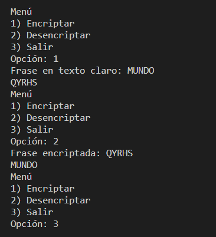

# Cifrado-Cesar
Cifrado y descifrado de cesar

## Sistema Operativo
- Windows 10

## Versión
- Python 3.9.1

## Ejecución
Ejecutar los scripts que se encuentran en la carpeta src del repositorio.

```python	

> python src\cesar_cifrado.py

```

## Ejemplo


